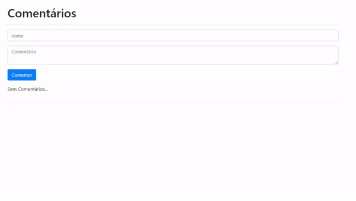

# vuejs-cli - A simple To Do List
_OBS: Este App pertence ao canal [Programador a bordo](https://youtu.be/cSa-SMVMGsE), feito para fins didáticos._

## Tecnologias
- VueJS
  - CLI
- Bootstrap
- JavaScript

## Screenshots (GIF [28 seg])


## Configuração do Projeto
```
yarn install
```

### Compilador e hot-reloads para desenvolvimento
```
yarn serve
```

### Compila and minifica para produção
```
yarn build
```

### Customize configuration
See [Configuration Reference](https://cli.vuejs.org/config/).
